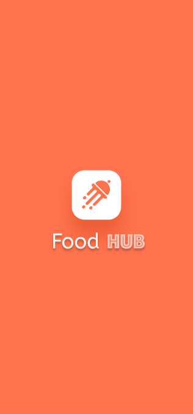
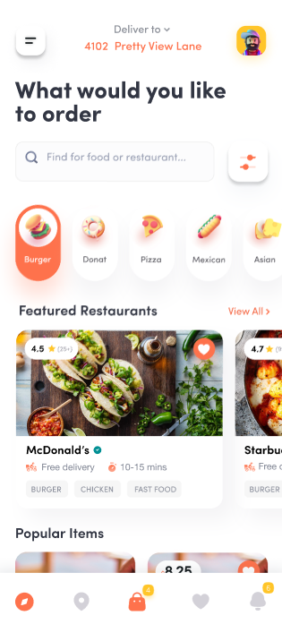

# 👋 Hi, I'm Momen Rizq

<div align="center">
  
  

</div>

## 🚀 About Me

```dart
class MomenRizq {
  final String role = "Flutter Developer & Programming Instructor";
  final String location = "Egypt 🇪🇬";
  final String education = "B.Sc. Software Engineering - KFS University";
  final int experienceYears = 2;

  final List<String> expertise = [
    "Flutter & Dart",
    "Clean Architecture",
    "State Management (Bloc/Cubit)",
    "Firebase Integration",
    "Teaching & Mentoring"
  ];

  final String currentFocus = "Building high-quality, scalable mobile applications";
  final String passion = "Teaching programming fundamentals and Flutter development";

  void sayHi() {
    print("Always learning, always building! ☕💻");
  }
}
```

- 📱 **2+ years** of real Flutter development experience
- 👨‍🏫 Currently working as **Flutter & Programming Instructor** at Mindset Training
- 🎓 Graduate of **Software Engineering** from Kafr-Elsheikh University (GPA: 3.2/4.0)
- 💼 Freelance Flutter Developer building production-ready apps
- 🧠 Passionate about **Clean Architecture**, **SOLID Principles**, and **Design Patterns**
- 🌱 Teaching programming to different age groups, simplifying complex concepts
- 💬 Ask me about **Flutter, Dart, Firebase, Bloc, Clean Architecture**
- 📫 Reach me: **momenrizq20@gmail.com**
- ⚡ Fun fact: I learn by teaching, and teach what I learn!

## 📱 Featured Projects

### 🛋️ Decor App - Home Furniture Store

[](https://github.com/MomenRizq/Decore_app)

A fully structured Flutter mobile app for browsing and purchasing home decor products.

**🔧 Tech Stack:** Flutter • Firebase • Clean Architecture • Cubit • JSON

**✨ Key Features:**

- Firebase Authentication (Email/Password, Google, Facebook)
- Cart Management & Wishlist
- Clean Architecture implementation
- Simulated backend using local JSON

**📸 Screenshots:**

<!-- Add your screenshots here -->
<div align="center">
  
  
  
  
  
  
  
  
  
</div>

---

### 🥬 Grocery Store Mobile App

[](https://github.com/MomenRizq/grocery_app)

Full-featured vegetable store app with multiple authentication methods.

**🔧 Tech Stack:** Flutter • Firebase • Provider

**✨ Key Features:**

- Multi-authentication (Email, Google, Visitor Mode)
- Product browsing with search functionality
- Shopping cart & preferences list
- Dark mode support
- Password reset via email

**📸 Screenshots:**

<!-- Add your screenshots here -->
<div align="center">
  
  
  
  
  
  
  
  
  
</div>

---

### 🎛️ Admin Panel for Grocery App

[](https://github.com/MomenRizq/grocery_admin_panel)

User-friendly admin control panel for product and order management.

**🔧 Tech Stack:** Flutter • Firebase • Provider

**✨ Key Features:**

- View, add, and modify products
- Comprehensive order tracking
- Simple and intuitive design
- Efficient product management

**📸 Screenshots:**

<!-- Add your screenshots here -->
<div align="center">
  
  
  
  
  
  
</div>

---

### 🍔 Restaurant Food Ordering UI

[](https://github.com/MomenRizq/food_app_UI)

Beautiful, responsive UI design for food ordering application.

**🔧 Tech Stack:** Flutter

**✨ Key Features:**

- Responsive design for all screen sizes
- Light & Dark mode support
- User-friendly food browsing interface
- Cross-platform compatible

**📸 Screenshots:**

<!-- Add your screenshots here -->
<div align="center">
  
  
  
  
  
  
  
  
</div>

## 💡 Random Dev Quote

<div align="center">
  
  

</div>

---

<div align="center">
  
  ### 💭 "Code is like humor. When you have to explain it, it's bad." - Cory House
  
  ### Show some ❤️ by starring ⭐ some of my repositories!
  
  

</div>
